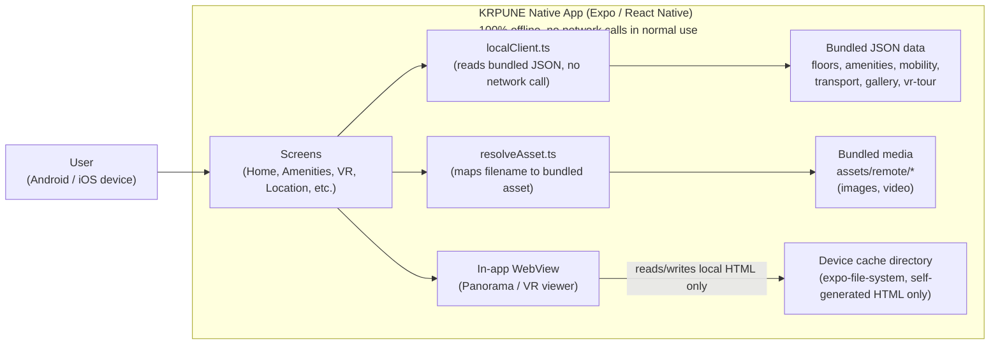
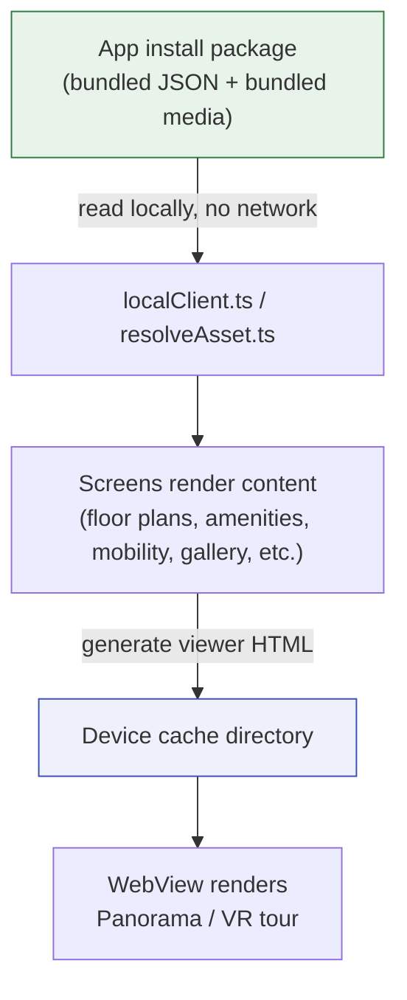

# KRPUNE Native - Architecture and Data Flow

Derived from a static review of the app source code on 2026-07-16. This shows what the app actually does, based on reading the code, not an assumed design.

## Network / Component Diagram

## Data Flow Diagram

## What this shows

- The app has no backend server or API of its own, and makes no network calls at all during normal use.
- All content, floor plans, amenities data, mobility/transport info, gallery images, and VR tour video/panoramas, ships bundled inside the installed app package.
- A few source files still contain strings that look like Cloudinary URLs, left over from the original web app. These are only used as filename keys passed into resolveAsset(), which matches them against a locally bundled asset map and loads the file from the device, not the network. All of these were confirmed to resolve locally. There is a defensive fallback in resolveAsset() that would stream from the URL if an asset were ever missing from the bundle, but this path is not used by the app as currently built.
- No user data is collected, stored, or transmitted. No login, no forms, no AsyncStorage/SecureStore usage found in the code.
- The VR/panorama viewer writes a self-generated HTML file into the device's local cache and loads it into an in-app WebView. This stays entirely on-device; nothing here leaves the phone.

This matches what is documented in `1. Network Architecture Diagram Template.txt`, `2. Data Flow Diagram Template.txt`, and `4. Mobile App Source Code Review Report Template.txt` - this file just gives it as a visual diagram alongside those write-ups.
