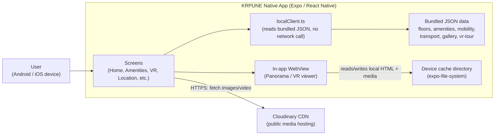
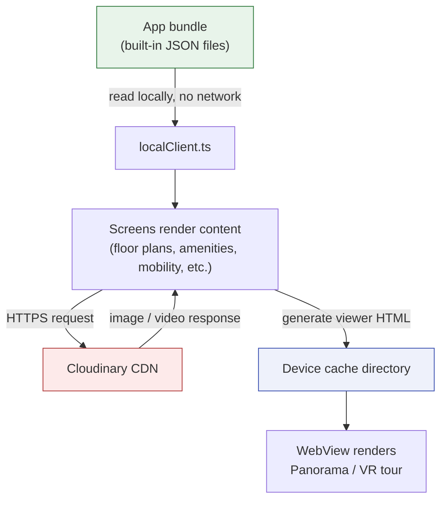

# KRPUNE Native - Architecture and Data Flow

Derived from a static review of the app source code on 2026-07-16. This shows what the app actually does, based on reading the code, not an assumed design.

## Network / Component Diagram

## Data Flow Diagram

## What this shows

- The app has no backend server or API of its own. Everything except images/video is bundled inside the app at build time.
- The only outbound network call the code makes is to Cloudinary, over HTTPS, purely to fetch public images and video for display. Nothing is sent to Cloudinary, only requested from it.
- No user data is collected, stored, or transmitted. No login, no forms, no AsyncStorage/SecureStore usage found in the code.
- The VR/panorama viewer writes a self-generated HTML file into the device's local cache and loads it into an in-app WebView. This stays entirely on-device; nothing here leaves the phone.

This is the same conclusion documented in `1. Network Architecture Diagram Template.txt`, `2. Data Flow Diagram Template.txt`, and `4. Mobile App Source Code Review Report Template.txt` - this file just gives it as a visual diagram alongside those write-ups.
